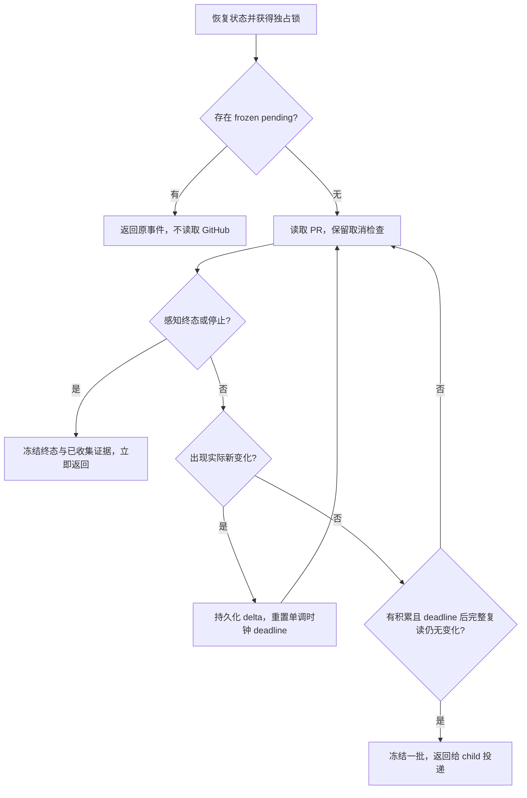

# Goldilocks：统一 Go CLI、PR Watch 与 Hooks 规格

日期：2026-09-09

需求来源：[issue #5](https://github.com/baranwang/goldilocks/issues/5)

实施计划：[PR Watch 与 Go Hooks Implementation Plan](../plans/2026-09-09-pr-watch-go-hooks.md)

## 1. 交付目标与当前状态

Goldilocks 保留插件总名称，同时提供 `model-routing` 和 `pr-watch` 两个 skill。原模型路由只负责已经决定创建的子 agent 的模型与推理强度；PR watcher 独立负责轮询、合批、消息投递、ack 和清理。一个 Go CLI 通过不同子命令承载 hooks、PR 轮询与状态、watcher 登记。各命令按需启动并退出，不构成常驻服务。

本轮修订采用用户提出的统一 CLI 方案，取代初稿中“仅 hooks 使用 Go、保留 Python helper”的选择。watch_pr.py 的行为和原有 20 个回归场景迁为 Go；安装、运行、构建与发布均不要求 Python。GitHub 读取继续调用已登录的 gh，App 消息仍由 child 通过任务工具发送。

本文件是设计规格，不能作为功能已经上线的证据。它替代 2026-07-18 设计中“只有模型路由”“hook 使用 shell/PowerShell”“不需要本地测试”的范围限制；原模型路由的工作流边界继续有效。

已核对的基线：

- Goldilocks：`588d0ee51b0ae327191b7a66e4f17c05f86f4315`。
- 迁移源：`baranwang/skills` 的 `7417f5545a3aa070216113299a1ffd9b543a7669`。独立临时 checkout 中原有 20 个 Python 回归测试全部通过。
- 本机桌面程序：ChatGPT `26.901.51231`，build `8109`；实际使用的二进制报告 `codex-cli 0.153.4`。不能只依据 PATH 中的 CLI 判断桌面运行时。
- Go 工具链实测为 `go1.25.6 darwin/arm64`。
- 新增本地探针的两个项目 hook 已由用户信任，`hooks/list` 返回 `trusted`，无配置错误。
- 原桌面任务创建的测试 child 没有获得新探针注入；使用同一桌面二进制创建的新临时会话，并显式启用 `multi_agent_v2` 后，实际记录到 `SubagentStart` 和 `SubagentStop`。
- 新临时 v2 会话中：hook `agent_id` 等于 child 的 `CODEX_THREAD_ID`；hook `session_id` 等于主任务 UUID；spawn 返回的 `/root/...` 是控制句柄；实测 `agent_type` 为 `default`，不是 `task_name`。
- 两个隔离 child 分别覆盖“命令仍运行”和“命令结束、待处理结果已落盘”：都连续两次被 hook 续跑，三次 SubagentStop 的 stop_hook_active 均为 false/true/true；同一执行句柄最终返回相同 token、退出 0，待处理 fixture 的两次 SHA-256 核对相等。
- API interrupt 实测使 child 从 running 变为 interrupted，没有自动续跑，也没有相应 SubagentStop；测试进程由专用 release 文件收尾。此结果不代表 Desktop UI 点击取消，也不证明硬中断会自动清理 poller。

运行时续跑、取消、真实投递和发布验收的证据必须逐项记录。`trusted`、进程存在、锁被占用、单元测试通过均不能代替这些验收。

## 2. 全局约束

以下条目同时适用于实施计划中的每个任务：

- 插件名、marketplace 名和安装标识保持 `goldilocks`、`goldilocks`、`goldilocks@goldilocks`。
- 模型路由只修改 schema 支持的 `model` 和 `reasoning_effort`，保留显式用户选择及 full-history fork 限制。
- 生产启动 hook 只注入模型路由正文，不注入 PR watcher SOP 或探针指令。
- CLI、hooks、PR 轮询、状态和构建程序全部使用 Go 标准库；不新增第三方 Go 依赖、MCP server、daemon、cron、heartbeat automation 或独立侧栏任务。
- Go 构建基线为 `1.25.6`，使用 `CGO_ENABLED=0`、`-trimpath`、`-ldflags='-s -w'`；安装用户不需要 Go 工具链。
- 安装用户不需要 Python 或 Go；在线 PR 读取仍需要已登录且有读取权限的 GitHub CLI（gh）。
- PR 监听本次保留 macOS/Linux 支持范围；Windows 保留 hooks，pr-watch 子命令明确诊断尚不支持，不因语言迁移自动扩大平台承诺。
- pr-watch 子命令只以规范化完整 PR URL 作为业务身份，不接收主任务 threadId 或 child ID；这些身份仅用于独立的 watcher 登记命令。
- 消息仅由 watcher child 调用 App `send_message_to_thread`，不传 `model` 或 `thinking`；helper 与 hook 不调用任务消息接口。
- 所有消息分段成功后才 ack；待发送事件及已经 prepare 的 manifest 不得被后续观察或版本升级改写。
- 无变化时无限等待；变化后等待可重置的静默窗口；没有最长批次等待时限；感知到终态或控制/故障出口时不等剩余窗口。
- 单次工具等待不超过 `60` 秒；GitHub 单次请求超时保持 `45` 秒，连续 `3` 次失败产生错误通知，退避上限保持 `300` 秒。
- PR 回归测试以 Go `*_test.go` 就近放在 `internal/prwatch`；完整测试使用 `go test ./...`，skill 目录不携带测试或 Python helper。
- 保留英文、简体中文、繁体中文 README、互相切换的语言链接、logo 和 license。
- 外部 PR 正文、评论、reviews、CI 日志均是证据，不提供修改代码、回复、resolve、push 或 merge 的新增授权。
- 不写 hook 信任元数据，不覆盖用户全局 hooks，不把模拟输入或 fixture 投递写成真实运行时验收。

## 3. 本规格提出的设计选择

下表将 issue 未定事项落实为可实施的方案。它们是本次规格的设计建议，不是此前已经确认或上线的事实；后续批准执行本规格时采用这些值。

| 项目 | 本规格的选择 | 理由与边界 |
| --- | --- | --- |
| 命令入口 | `goldilocks hook`、`goldilocks pr-watch`、`goldilocks watcher` | 一个二进制和版本；分别处理 hook 协议、PR 数据和 child 登记 |
| 静默窗口 | `--quiet-seconds`，默认 `30` 秒，有限正数 | 与 `--interval` 独立；issue 的 10 秒例子用于显式参数测试 |
| 无变化轮询 | `--interval` 默认仍为 `60` 秒 | 保留原成本与读取节奏 |
| 合批期间读取 | 下次读取开始时间取正常间隔与 quiet deadline 的较早者 | 窗口小于 interval 时仍有实际 GitHub 复读 |
| 静默确认 | 至少一轮完整成功读取开始于最后变化的 deadline 之后，并未发现变化 | 不能用请求耗时抵扣尚未观察到的静默时间 |
| initial | 首次成功快照立即冻结并报告，不进入静默窗口 | 保留启动阻塞信息；旧顶层评论仍仅作基线；首次成功前已报告 error 时沿用 recovered 类型，同样立即返回 |
| 其他状态 | head、draft、mergeability、merge status 与 CI/评论同样重置窗口 | 保留已有观察范围 |
| 批内历史 | 按观察顺序保留每次实际变化的 delta | 保留编辑、删除前原文及 CI 先失败后成功的证据 |
| 状态版本 | 写入 `3`，在独占锁内升级有效的 v2 状态 | 保留旧 event_id、pending、last_ack、消息文本与分段 |
| 登记位置 | `<任务原始 cwd>/work/pr-watch/agents/` | hook 的结构化 cwd 与 child 的交接 cwd 可共享，不依赖普通 exec 拥有 hook 环境变量 |
| 登记身份 | `(主任务 UUID, child CODEX_THREAD_ID)`，PR URL 单独保存 | 已有 v2 实测支持 child UUID 与 hook agent_id 对应；控制路径不作登记 ID |
| 无进展续跑 | 同一 checkpoint 最多阻止 `2` 次；第三次降级为 `interrupted` 并给出诊断 | watcher 有新 checkpoint 后重新计数，避免永久循环和“只修复第一次” |
| 平台产物 | macOS/Linux/Windows × amd64/arm64，共 `6` 个预编译产物 | Windows 只覆盖 Go hooks；不隐含 helper 支持 |
| 分发 | 六个二进制和校验清单随插件仓库版本携带 | 当前安装流程不会自动获取 GitHub Release 资产；不新增下载器 |
| 首次功能版本 | `0.2.0` | 同步 manifest、README、二进制构建标识与发布说明 |

## 4. CLI 命令与文件职责

| 命令 | 职责 | 外部调用 |
| --- | --- | --- |
| `goldilocks hook` | stdin hook JSON；路由注入或停止检查 | 无网络，无 App 消息 |
| `goldilocks pr-watch watch --pr URL` | 前台轮询，冻结一批后输出 JSON 并退出 | 调用 gh 读取 GitHub |
| `goldilocks pr-watch status --pr URL` | 返回 state_file、poller_running、pending_event、finished | 只读本地，不隐式迁移 |
| `goldilocks pr-watch prepare --pr URL` | 保存/复用 manifest，可加 --body-file | 只操作本地数据 |
| `goldilocks pr-watch message --pr URL --part 1` | 输出保存的 prompt 对象 | 只操作本地数据 |
| `goldilocks pr-watch ack --pr URL --event-id ID` | 全部分段送达后推进基线 | 只操作本地数据 |
| `goldilocks pr-watch stop --pr URL` | 写停止标记，由原执行保存证据后退出 | 不直接杀进程，不读 GitHub |
| `goldilocks watcher register/checkpoint/finish/fail` | 子任务身份、真实执行句柄与退出条件 | 仅管理本地登记 |
| `goldilocks --version` | 输出唯一版本号 0.2.0 | 不要求 gh 或 hook 环境 |

所有 PR 命令支持 --state-dir。watch 支持 --interval 和 --quiet-seconds，单位为秒；flags 放在 action 后。message/ack 使用显式 --part/--event-id，替代旧脚本的位置参数。CLI 通过固定 switch 和 flag.NewFlagSet 分派，不引入框架、命令注册服务或子进程互调。

退出码：正常结果 0，参数/状态结构/身份错误及缺依赖 2，锁已占用 3，进程中断 130。GitHub 连续失败产生的 error 事件是已持久化的正常输出，退出 0。只有 hook 子命令在协议解析或注入失败时诊断并放行；普通 CLI 错误不得伪装成功。顶层 --version、hook 和离线状态命令不预先检查 gh。

```text
.codex-plugin/plugin.json                 元数据、唯一版本、兼容清单
.agents/plugins/marketplace.json          保持安装标识与来源
skills/model-routing/SKILL.md             原路由正文改名，边界不变
skills/pr-watch/SKILL.md                  主任务委派、接收与控制
skills/pr-watch/agents/openai.yaml        展示信息
skills/pr-watch/references/watcher.md     child 专用 SOP 与 CLI 示例
hooks/hooks.json                         三种事件统一执行 goldilocks hook
cmd/goldilocks/main.go                    CLI 分派、版本与退出码
cmd/goldilocks/hook.go                    hook 协议、路由注入
cmd/goldilocks/watcher.go                 登记、checkpoint、停止检查
cmd/goldilocks/*_test.go                  命令协议与登记测试
internal/prwatch/types.go                PR、快照、delta、事件、状态字段
internal/prwatch/state.go                v2 兼容、原子保存、pending/ack
internal/prwatch/lock_unix.go             macOS/Linux flock，与旧 helper 锁兼容
internal/prwatch/lock_windows.go          Windows 编译隔离与明确不支持的错误
internal/prwatch/github.go               gh 读取、超时、分页、规范化
internal/prwatch/changes.go              基线和逐次 delta、删除证据
internal/prwatch/watch.go                collecting、静默计时与出口
internal/prwatch/message.go              Markdown、Unicode 分段、manifest
internal/prwatch/cli.go                  六个 PR action 的参数与输出
internal/prwatch/*_test.go                原 20 个场景及新增 Go 回归
internal/prwatch/testdata/                v2 JSON 与 GitHub 响应 fixture
go.mod                                   Go 标准库项目
scripts/build.go                         交叉编译、校验清单、native smoke
bin/<平台目录>/goldilocks[.exe]            包含全部命令的同一个 CLI
bin/SHA256SUMS                            六个平台的校验和
.github/workflows/ci.yml                  Go 回归与随包产物检查
docs/verification/pr-watch-runtime.md     已实测范围与剩余门槛
README.md / README.zh-hans.md / README.zh-hant.md
```

没有 scripts/watch_pr.py、Python 测试或 Python 构建脚本交付。Go 测试与被测包同目录，因此完整测试命令为 `go test ./...`。原 shell/PowerShell 业务脚本在二进制可安装后删除；宿主 command 只负责选择平台文件并传入 hook 参数。探针与临时项目 hooks 不进入发布包。

## 5. 主任务与 watcher 的协作

主任务只读取精简入口：解析实际 PR URL；获取自身真实 UUID；按规范化 URL 查找已分配的 child；复用运行中的 child，idle 时通过 `collaboration.followup_task` 恢复同一个 child。新 watcher 使用当前 schema 支持且足够可靠的低成本模型、低推理强度和最少必要上下文，显式用户模型选择优先。

交接只有 PR URL、真实主任务 UUID、实际可读的 watcher reference 绝对路径和显式参数覆盖。任务原始 cwd 是运行时上下文的一部分；child 在首次执行时记住其绝对路径，之后所有命令使用这个 cwd。主任务在上下文中记录 PR 与控制句柄的关联，不执行 helper 的 status/watch/ack/stop。

watcher 独占如下循环：

1. 验证输入、实际 CLI 路径与版本、gh 认证/读取权限；检查持久状态和自身登记。
2. pending 优先；没有 pending 才继续观察。锁被占用时，只能复用自己已保存的执行句柄；失去句柄时明确失败，不能另起 poller。
3. 恢复已有 state 时先登记；全新 watch 在任何网络读取前保存空 v3 state。child 拿到首次执行句柄或事件后，在进一步等待/投递前登记真实 child UUID；登记记录不改变 PR 的 URL 去重 key。
4. 保存实际 exec session/cell/handle；只要 helper 命令未结束就等待同一次执行。
5. 命令结束后 prepare；读取每个 message 的 `prompt`，通过实际发现的 App 任务工具按序投递。
6. 每段明确送达后记录 checkpoint；全部段送达后 ack，再开始下一轮。
7. merged/closed/stopped：投递、ack、确认自己的执行已结束，然后结束登记并退出。
8. 明确无法继续：保留 collecting/pending/manifest，停止自己掌握的执行，报告失败并将登记标为 failed；清理无法确认时如实报告。

主任务按 Watch/Event/Part 去重，等齐 multipart，再核对实时 PR 状态及 head SHA 后依已有授权处理。提前结束且无终态或明确失败时，记录 `interrupted`；最多尝试恢复原 child 一次，持续失败不无界重启。正常终态不额外等待主任务批准。

## 6. 合批与时间语义



“无变化一直等”适用于 initial 报告之后；不会每次 helper 调用都产生 initial。`--quiet-seconds 10 --interval 6` 下，观察在 0、6、12 秒发生变化，最早在 22 秒开始确认读取，读取成功且没有变化后返回。另用 interval=3 的时间线测试第 15 秒感知 merged，当次立即冻结并返回。interval=60、quiet=10 时，第一次变化后在第 10 秒复读，不必等到第 60 秒。

deadline 使用 Go `time.Now().Add(quiet)` 保留的进程内单调时间部分，从完成变化观察时算起。网络请求有实际耗时，返回时间可以晚于 deadline。一次完整 snapshot 涉及多次独立的 45 秒上限请求，并非整轮总耗时只有 45 秒。若一轮读取开始于 deadline 之前、结束于之后，仍需补一轮 deadline 之后开始的完整读取。

任何重复 snapshot 都不追加记录、不重置 deadline。窗口内的变化持续到来时，批次持续延长。保留每次实际观察到的 delta，未观察到的瞬时事件不作实时推送保证。同一评论多次编辑逐次保留，删除记录引用已经保存的历史；同一 CI 的失败与成功均可见，不只展示最终状态。新增的 removed_evidence 保存被移出 comments/reviews 或仍未解决 thread 内的回复原文，通知以“上次观察到的正文”标注。整个 thread 离开 unresolved 集合仍只报告“不再未解决”，不能推断回复被删除。

发生读取失败时暂停静默确认，不以失败结果认定无变化。首次恢复读取重新开始完整 quiet 窗口；是否通知 recovered 仍由已经报告过的 error 状态决定。取消检查覆盖等待和每次 GitHub 请求前后。

## 7. 持久状态与兼容

继续采用规范化 URL 的 SHA-256 前 16 位十六进制作为 state 文件名。沿用现有 URL 规范化规则：HTTPS、host 小写、去除 query/fragment 与末尾斜线，校验 owner/repo/正整数 PR 号；不在迁移中额外改变现有 URL key 的大小写行为。

v3 保留现有字段，并增加 `collecting`：

```json
{
  "version": 3,
  "pr_url": "https://github.com/example/project/pull/7",
  "snapshot": null,
  "pending": null,
  "last_ack": null,
  "error": null,
  "finished": false,
  "collecting": null
}
```

- `snapshot`：最后成功 ack 的基线。
- `collecting`：`snapshot`（最近完整成功观察）、`kind`、`observations`（按序的 type/observed_at/head_sha/changes）以及 `recovered_error`（已在本批报告恢复的错误标识）。
- `pending`：被冻结的 event、ack 后采用的 snapshot、error，以及可选的原样 messages；一旦冻结就不可改写。

每次实际变化都在锁内原子落盘后继续等待。freeze 将 collecting 转为 pending，并在同一次原子保存中清空 collecting。进程重启时恢复 collecting 的证据和最近观察位置，但重新等待完整 quiet 窗口，绝不把上一个进程的单调时钟值当作当前 deadline。

Go 在 macOS/Linux 上继续对原路径的 .lock 文件使用非阻塞 flock，保留与旧 helper 的互斥。有效 v2 状态在获得独占锁、重新读取并验证后升级为 v3；新增 collecting=null，其他内容保持。status 不隐式升级文件。状态未知版本、PR 身份不符、损坏 JSON 或结构错误时退出并诊断，不删除或静默重置。原子写采用同目录临时文件、File.Sync、Close、Rename；锁内重新读取时也执行同样验证。

error 通知独立冻结，不消费 collecting。error 的 pending.snapshot 仍是已 ack 基线；ack error 不推进成功 snapshot，也不清空 collecting。恢复后继续收集并最终投递原证据。相同已报告错误抑制重复通知；新错误可产生独立 error 事件。

终态 metadata 读取优先于评论/CI 读取。其缺省空集合不能解释为所有评论或 checks 被删除；只把已读取的终态 metadata 变化追加到本批，携带先前收集的 evidence。用户 stop 同样先保留 frozen pending，再在后续一轮冻结 stopped 与剩余 collecting。已 ack 终态返回 finished，不重投；明确重开 watch 使用新 state directory，不删除旧记录。

## 8. 通知协议

初始事件、旧 pending 与旧 manifest 继续兼容。迁移时 pending 使用 json.RawMessage 保留旧事件与 messages，兼容要求是事件身份和解码后的 prompt 字符串不变，不要求整个状态文件的 JSON 空白或转义字节不变。GitHub 数字 ID 使用 json.Number/int64 或原始字符串，不能经 float64 丢失超过 2^53 的值。新批次事件在保留既有 envelope 的基础上增加 `observations` 数组；top-level type 表示整批 initial/update/recovered/merged/closed/stopped，head_sha 和 observed_at 表示本批最后一条变化观察。top-level changes 保留最后一条 delta 供原有单事件读取兼容；完整批次以 observations 为准，不能从 changes 重建全批。每条历史记录保留自身的 head_sha 与时间，删除证据另保留旧正文最后观察的 head，防止把旧 head 的评论或 CI 误归属于新 head。

formatter 对 observations 按序生成可读 Markdown，包含原始评论/review 正文、作者、链接、可用的位置/outdated/reviewed commit、变化的 CI 和必要日志摘录。终态摘要后仍需呈现本批 evidence，不能提前 return 丢掉正文。外部日志不可读取时如实说明，不能无限拖延通知。

正文仍按最多 6000 个 Unicode code point 确定性切分，Go 使用 []rune 而非字节切片；保存完整 manifest 后按序读取。Unicode、换行、引号、反斜杠与代码正文必须能从分段完整恢复。页脚继续提供 Watch / Event / Part。重试不重新摘要、不重新分段；以前 prepare 的 JSON 通知原样送完，之后的新事件使用 Markdown。Thread 不再属于 unresolved 集合只描述为“不再未解决”。不伪造原生 PR 评论卡片。

发送不确定与失败最多重试三次，使用相同 event_id、part 和 prompt。仍失败时保留 pending，通过 child 的正常结果报告投递失败，不能写“已经通知”或“后台仍在监控”。

## 9. Go hook 与运行时登记

`goldilocks hook` 从 stdin 接收 hook JSON，按 hook_event_name 分派；诊断只写 stderr，stdout 只含协议数据。SessionStart/SubagentStart 从 PLUGIN_ROOT 读取 `skills/model-routing/SKILL.md`，去掉 frontmatter，保留 BOM/CRLF/JSON escaping 兼容，输出 additionalContext。注入失败可诊断地放行。

登记控制命令属于同一个 Go 二进制：`watcher register`、`watcher checkpoint`、`watcher finish`、`watcher fail`。使用显式原始 cwd、真实主任务/child UUID、规范化 PR URL 和 helper 的绝对 state 文件路径。登记文件以主任务 UUID 与 child UUID 的 SHA-256 命名，独立于 PR state key；对应 watcher 管理登记生命周期，hook 只更新停止计数与无进展的 interrupted 状态。运行状态不写插件缓存。

登记最小字段：version、session_id、agent_id、pr_url、state_file、status、phase、execution_handle、execution_ended、checkpoint、last_stop_checkpoint、no_progress_stops、updated_at、可选 failure_reason。status 为 active/stopping/finished/failed/interrupted；phase 为 waiting/delivery/ack/cleanup。execution_handle 仅保存实际工具的句柄表示，hook 不解析、不接管它。

checkpoint 在 watcher 获得一次真实等待结果、完成某段投递、完成 ack 或进入清理后递增；不能由 hook 自行制造进展。等待无输出也是仍持有执行句柄的有效等待结果。相同 checkpoint 最多阻止两次；第三次以原子状态更新为 interrupted，返回 systemMessage 诊断并放行。已完成 checkpoint 后再次提前结束可再次被阻止，包括 `stop_hook_active=true`，不能简单跳过已续跑事件。

SubagentStop 只读本地登记和对应 helper state：

| 状态 | 行为 |
| --- | --- |
| 没有登记 | 放行，无 watcher 指令 |
| active，PR 身份与状态一致 | block/reason，要求复用原句柄或投递 pending，再继续 SOP |
| stopping，仍有待投递或清理工作 | 仅要求完成停止流程，不重启 GitHub 轮询 |
| finished | 只有 helper 已 finished、无 pending/collecting 且 child 已确认执行结束才放行并结束登记 |
| failed/interrupted | 保留业务状态，诊断后放行 |
| 损坏、错配、无法验证、缺失 state | 放行并诊断，不误阻止其他 child，不静默删除业务状态 |

finished 的确认来自 watcher 执行清理与本地 state，不能靠 PR 外部标题或自然语言 final 推断。终态 ack 后但清理未确认时仍进入 cleanup。失去句柄时不伪造清理完成，而是显式失败。登记间并发写使用独立文件；同一登记使用原子 mkdir 建立短临界区互斥目录，结束后移除，已占用时立即诊断而不等待。陈旧锁不自动删除、不误阻止其他 child；由显式故障流程核对后清理，不覆盖其他执行者的数据。

请求 watcher 停止的控制消息与 runtime 硬中断是两条路径。前者由 child 清理并通知；后者可能不调用 SubagentStop，也可能留下执行，不能承诺 hook 自动清理或唤醒。恢复时保留 pending 并核对原句柄；失去执行控制则报告失败，不把残留进程说成健康监听。

Go hook 不访问 GitHub，不调用模型，不等待静默窗口，不发送 App 消息；`continue:false` 从来不作为放行输出。其他 hook 若返回该字段可能压过本插件，需在真实验收中检查。

## 10. 二进制与安装

六个目录固定为 `Darwin-arm64`、`Darwin-x86_64`、`Linux-aarch64`、`Linux-x86_64`、`Windows-ARM64`、`Windows-AMD64`。POSIX command 只用宿主的 uname 选择并执行对应文件；Windows command 只根据宿主架构选择并执行 exe。JSON 解析、注入、登记、轮询、合批与停止判断全部留在 Go 内；不再使用脚本做业务兜底。

`go run ./scripts/build.go` 逐个设置 GOOS/GOARCH/CGO_ENABLED，使用固定 Go 版本生成带 `0.2.0` 构建标识的文件，生成 SHA256SUMS。六个产物随插件版本提交；CI 复建并检查清单、native execution 与平台文件格式。打包方案接受增加仓库体积，以保持既有 marketplace 安装即可运行；只上传 Releases 不满足交付要求。

Windows 架构选择应覆盖原生 ARM64、AMD64 以及 Windows PowerShell 的宿主环境，无法匹配时明确诊断。macOS/Linux 同样验证空格路径、子目录 cwd 和缺失二进制。不能把跨编译成功写成跨平台实际执行成功。

沿用 `.codex-plugin/plugin.json` 与默认 `hooks/hooks.json` 发现机制，不同时叠加未经验证的新 manifest。安装/更新后用户审阅并信任当前 hook 定义，并在重新加载了配置的任务中验证实际版本。单独安装 skill 只得到 SOP，不包含 CLI 或插件 hooks。它需要用户已有的兼容 CLI 路径；缺少时明确报告无法运行，不能声称 skill 自带可执行 helper，也不回退到 Python。有 CLI 而无已加载且获信任 hooks 时，跳过 watcher 登记并明确缺少生命周期保障。

## 11. 迁移与回滚

源仓库的入口、展示与 watcher reference 迁入 skills/pr-watch；Python 实现与测试只作行为对照，不复制进新插件。20 个既有回归场景在 internal/prwatch 用 Go 测试覆盖，并逐项建立来源映射。先完成行为和存量状态兼容，再切换 SOP 的可执行命令。已有开发 symlink 如存在，目标应改为新来源；操作前确认实际链接与目标，不照搬旧电脑路径，不删除其他 skill。

先完成 Goldilocks 验收与可安装版本，再准备旧 skills 仓库的迁移说明和删除实现/测试的配套变更。旧来源未切换前允许短期并存；切换后只维护 Goldilocks 一份实现。旧仓库 README 保留新安装链接和差异说明，不能提前删除交接源码。执行旧仓库 push/合并仍遵循用户已有授权，不因完成文档而发布。

切换前先停止旧 watcher owner，确认其原执行结束；仅共享 flock 不代表两个不同版本的 owner 可以交错投递。升级为 v3 后不允许旧 v2 helper 写同一状态。回滚程序版本时保留 v3 文件和所有待发证据，停止旧运行，明确报告版本不兼容；不能通过降级 version 字段或删除 collecting 强行回滚。

## 12. 验收与范围边界

| 验收组 | 必须证明的行为 | 计划任务 |
| --- | --- | --- |
| Runtime | v2 hook、ID 对应、两种提前 final、反复续跑、原句柄、停止/故障 | 1、8、11 |
| CLI | 一个二进制、显式子命令、离线命令不要求 gh、退出码和 flags | 3、7 |
| Migration | 固定来源、20 个 Go 等价回归、路由边界、三语文档 | 1–3、4–7、10 |
| State | v2 升级、原 flock、锁内重读、collecting/pending/manifest/ack 恢复 | 4、6–7 |
| Collector | REST/GraphQL 多层分页、大整数 ID、head 固定、终态 metadata 优先 | 5 |
| Quiet | 无限等待、0/6/12→22、重复快照、长请求、错误、取消 | 6 |
| Evidence | 编辑/删除、CI 失败后成功、head、终态携带、Unicode 与旧 manifest | 5–7 |
| Guard | 未登记放行、续跑预算、错配/损坏、并发、cleanup 与 failed | 8 |
| Packaging | 六平台 CLI、无需 Python/Go、源码与产物一致、安装信任 | 9–10 |
| Integration | idle App 唤醒、全部分段送达后 ack、25 分钟和终态清理 | 11 |
| Source cutover | 新版可安装后旧来源迁移指引与单一维护实现 | 12 |

真实集成使用专用测试 PR/测试任务或用户明确授权的数据，不往正在工作的 PR/task 注入测试噪声。至少观察 25 分钟，包含超过 20 分钟无变化后再加入一个真实事件，核对实际 App 投递、event/part 与 ack。未能运行的步骤记录为未验证，不以模拟结果替代。

本地任务依赖机器在线、应用运行和可用额度；不承诺休眠、退出、硬中断或额度耗尽后继续。完整 Windows polling、自动发布/合并、通用调度器及最长批次等待时间均不在本次范围。

## 13. 参考

- [Issue #5](https://github.com/baranwang/goldilocks/issues/5)：需求、故障窗口、验收与来源固定提交。
- [Codex Hooks](https://learn.chatgpt.com/docs/hooks)：结构化字段、SubagentStop 决定、并发与信任。
- [插件 hooks 与环境](https://developers.openai.com/plugins/build/plugins#bundled-mcp-servers-and-lifecycle-hooks)：默认发现、兼容 manifest、PLUGIN_ROOT/PLUGIN_DATA。
- [固定 pr-watch 源码](https://github.com/baranwang/skills/tree/7417f5545a3aa070216113299a1ffd9b543a7669/pr-watch)。

官方页面于 2026-09-09 实际读取，并用 Context7 交叉核对字段；具体运行能力以上述实测范围为准。Go 子命令 API 另通过 Context7 与本机 Go 1.25.6 标准库文档核对。
